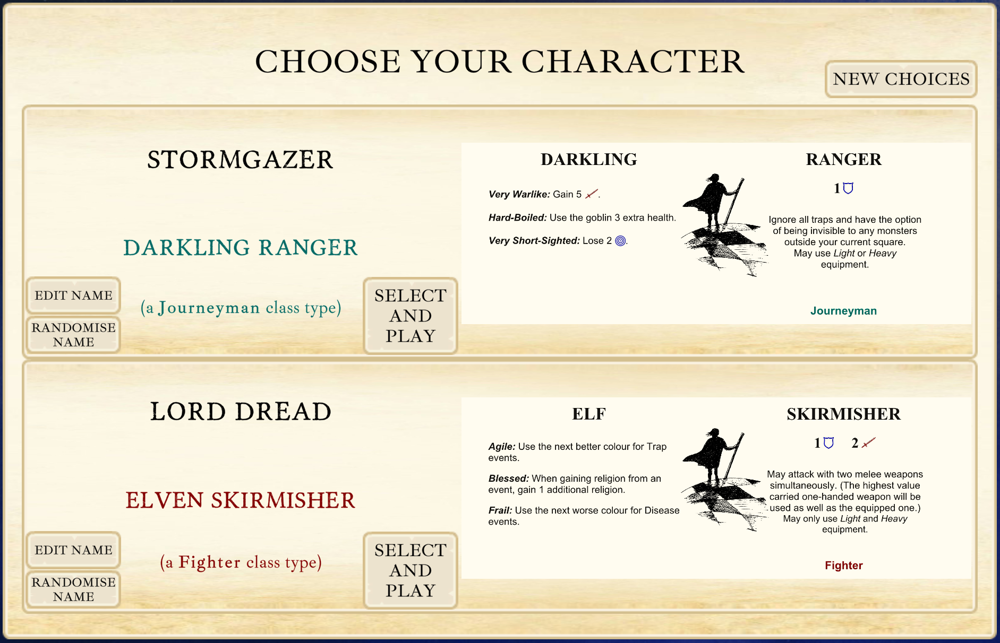
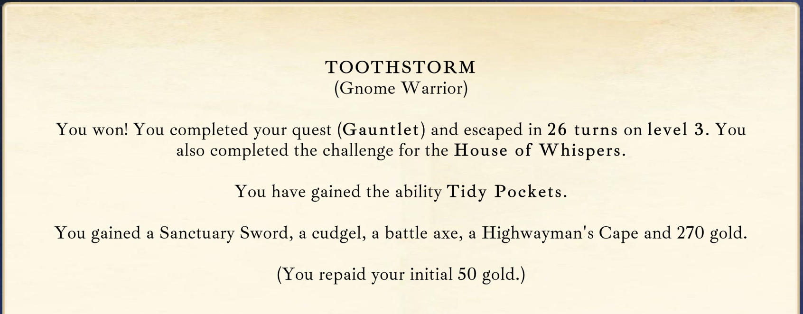

# Wayfarer: A C# Unity Passion Project

<br><br>

<br><br>

## Introduction

**Wayfarer** is a single-player turn-based 'dungeon crawler' game that runs in Windows. I wrote it in C# using Unity, and it has 110,000 lines of code. It is the very definition of a passion project - I spent two years developing it, with no intention of a public release. It was always just for myself and family and friends to play. During that time it has evolved in scope and complexity far beyond what I imagined when starting it.

<br><br>

<br><br>

## Game Overview

The core gameplay is that you start with a character, and have to win eight games to reach the title of Champion, at which point the character retires and you start with a new one. Each game is a snackable 15-30 minutes to play, and any items or gold you win a game with can be brought into the next one. So your character grows stronger with equipment and abilities as he or she progresses, but the challenges increase as you progress through the eight levels.

<br><br>

<br><br>

What makes Wayfarer unique is the sheer variety of things that can happen. Every game is completely unique and memorable and makes you want to tell someone about the crazy adventure you just had. This is achieved through multiple interacting complex systems combined with a high degree of randomness. This leads to emergent, entertaining and frequent laugh-out-loud or gasp-out-loud experiences.

<br><br>

<br><br>

To give you an idea of the staggering depth and variety, there are:

- 14 different procedurally generated **landscape** types to explore (Catacombs, Forest, Citadel, Swamp, Desert, etc.) with a unique layout every time.
- 17 different **landscape variations** (the catacombs or forest could be Frozen, Intense, Toxic, Sacred, etc.)
- 44 different **character classes** you can be, and 16 different fantasy **races**, each with unique advantages and disadvantages.
- 56 different **abilities** you can gain on winning a game to better equip you in subsequent ones.
- 255 unique **magic items** you can potentially find, use and keep.
- 48 **magic spells** you can potentially learn and cast.
- 56 classes of **NPCs** with different behaviours, skills and unpredictable personalities, along with a random name generator. Some will offer to join as a companion. Others will trade or attack. Sometimes they fight each other.
- 57 unique **monster** types with a range of possible behaviours.
- 23 different **trap** types.
- 23 different **diseases** you can catch that temporarily debuff you until they are cured.
- 13 **Houses** you can align yourself with giving you optional extra challenges and rewards if you succeed.
- 96 **Chaos effects** - dramatic and fun gameplay variants that you can trigger or try to avoid.
- **Laws** that you have the option of breaking, with stiff penalties if you are then caught by a Sentinel.
- **Pacts** you can make with demons that give you one of 21 possible boons with one of 16 possible costs.
- **Religion** points you can accumulate to ask God to help you out in a fix, which he may or may not do.
- Magic portals, quests, rumours, limb damages, curio locations, ranged weapons, arcane events, legendary items, a luck system and more!

<br><br>

<br><br>

<br><br>

## Technical Highlights

Here are some of the interesting things the game does.

### Landscape Generation

The game is a loose adaptation of a family board game I created years ago. One of the neat things about the original board game was the way the landscape is revealed as you explore. Each turn you move into a neighbouring square, and then iteratively reveal the surrounding walls or doors of any squares within sight. Then you discover if they contain anything, be it gold, an item, a trap, a monster, an NPC or whatever.

I used the same approach with this digital version of the game. Unlike the board game, though, the layout of walls and doors is procedurally generated in advance, hidden from the user and revealed as they explore. The contents of each location are still dynamically generated when they explore that square, because there are various factors that can change what you find. If you own a Luckvest or a Shrouded Lantern or a Helm of Iniquity, for instance, that changes what you may find as you explore.

Each of the 14 different landscape types - catacombs, forest, labyrinth, swamp, etc. - have a different distribution of walls and doors when pre-generating the landscape layout each game, along with specific peculiarities. Old City and Necropolis are claustrophobic but a higher chance of events. Desert and Caverns are more open. In Desert you can run faster but lose health if you do. In Necropolis, many of the creatures you find are undead. In Volcano, deadly lava gradually spreads across the board. In Forest you can glimpse creatures without them noticing you. In Lagoon you can dive into the large central water area with a high concentration of events, or skirt around it. In Citadel the walls are arranged in procedurally generated rooms, surrounded by a moat.

These diverse landscape types give a distinct flavour to each game. This is refined with a random selection of landscape variations each time you play, so in one game the Swamp may be _frozen_ where you can slide in straight lines. In another game it may be _toxic_ and you lose health every turn but healing is free at temples. In another it might be populated by NPCs, or infested with a particular type of monster. This combination of random landscape type and random set of variations means that not only is the procedurally generated layout different every game, but the theme of each game is unique before you've even started.

My guiding game design principle throughout has been 'The more varied and unpredictable, the better.' I think it adds a lot to the replayability to keep discovering things you didn't know could happen and rare magic items you've never seen before.

<br><br>

<br><br>

### _Code Snippet_ - how the Infestation landscape variation is created:

```c#
public static void InitialiseInfested(Square sourceSquare, bool addInitialMonster)
{
    infestationSource = sourceSquare;

    // Show the symbol of the infestation source on the board
    DungeonManager.CreateInfestationSymbol(sourceSquare);

    // Pick a monster type
    infestationMonsterType = Monster.GetRandomMonsterTypeForInfested();

    if (addInitialMonster)
    {
        // Start with one there
        InfestationIncreases();
    }

    // Smash surrounding walls and doors so they aren't just stuck in a box
    sourceSquare.DestroySurroundingBoundaries(true, true, false);

}

public static void InfestationIncreases()
{
if (infestationSource.isHaven)
{
// Monsters aren't allowed in Havens
RemoveInfestationIfItBecameAHaven();
return;
}

    // Don't exceed the maximum number of monsters in a square
    if (Monster.GetMonstersInSquare(infestationSource, false).Count <= maxMonstersInSquare)
    {
        // Spawn a new monster
        Monster monster = Monster.SpawnMonster(infestationSource, false);
        monster.Initialise(infestationSource, false, infestationMonsterType, true);
        monster.SetNotRareVariation();

        // Raise it up so it's not in the floor
        Utilities.SetGameObjectToPlayerHeight(monster.gameObject, false, infestationSource.isPitted, false, "newly spawned infestation monster");

        // Turn it so the monsters aren't all facing east
        Utilities.ApplyRandomRotationAndOffset(monster.gameObject);
        infestationSource.SeparateFiguresIfNecessary();

        // In case the player is nearby, check for reactions
        if (Character.initialised)
        {
            character.CheckIfVisibleMonstersReact();
            character.CheckIfVisibleMavericksReact();
        }
    }

}

public static void RemoveInfestationIfItBecameAHaven()
{
if ((infested || Chaos.pestilence) && infestationSource.isHaven)
{
string where = SquareContentsDescriber.GetDirectionDescription(infestationSource, Character.currentSquare);
Character.BroadcastLessImportantInfo($"The infestation source{where} has become a Haven so the infestation is over.");

        // No more infestation
        Chaos.pestilence = false;
        infested = false;

        // Remove the symbol in the square
        DungeonManager.RemoveSquareSymbolIn(infestationSource);
    }

}

```

<br><br>

<br><br>

### AI and NPC Behaviour

In the original board game, NPCs would either attack, trade or join you. The rest of the time they would just stand still in a square and do nothing. Here's a quick overview of how I made them more interesting and unpredictable.

First, I introduced wandering mechanics. If they are within 3 squares of your character, an NPC detects you and reacts. If they are hostile, they will move towards you; the same if they are friendly and you beckon them. If not moving because of you, they revert to independent movement. First, the code checks if there are valuables within sight, and if so, the NPC will move towards them and pick them up. If not, the NPC will wander at random, with a chance of not moving, and a lower chance of returning the way they just came, so that their movement seems more focused and directional. When they meet other NPCs or monsters, there is a chance of a fight.

Some NPC types are pacifist and won't ever provoke a fight; others are more aggressive. Some have specific known triggers, like a Bandit will attack you if you're perceived as 'rich, the value of your possessions exceeding a threshold. A Thug will attack you if you have low health. A Puritan will attack you if you have multiple diseases, and so on.

So that already makes the game feel more alive as these NPCs wander around with their different behaviours. But I wanted an extra level of unpredictability, so introduced secret personality traits. I came up with a list of possible triggers and a list of possible reactions, and each NPC gets one of each at random. One might give you his possessions if you enter a shop. Another might tell you a secret if you're in the dark without a light source. Another might attack you if you go through a portal.

You don't know what the NPC's secret personality trait or trigger is, so you're often surprised. Your loyal Smuggler companion may suddenly announce he was actually a Friar all along. The Jester you're trading with may pick your pocket. The Scribe might reveal he is carrying a magic item, or knows where one is.

In addition to these surprise behaviours, the NPCs have a small chance of being a demon in disguise who will offer you a pact. They also pay for healing at temples if wounded. If your NPC companion is carrying a potentially dangerous Chaos item, they will initially express curiosity about it, then try to resist temptation, then finally activate it. Some will grab items you find lying around before you have a chance to. Some will initiate attacks on nearby monsters - "Let's do this!" - that you really don't want to provoke. Some will drag you through portals you didn't want to go through. Others will feel sorry for you and give you gold if you're poor.

These are all relatively simple behavioural systems that can barely be called AI, but combined they give the impression of a living world and often produce delightful and unexpected interactions.

<br><br>

<br><br>

<br><br>

### _Code Snippet_ - testing whether an NPC (called a Maverick in the game) is actually a Demon.

```c#
public void SeeIfSecretlyADemon()
{
    // During Witching Hour, they are always a demon
    if (Phase.IsCurrentPhase(PhaseType.WitchingHour))
    {
        isADemon = true;
        return;
    }

    // Skip if we've tested them before, or they're a Bounty Hunt target or a Stalker
    if (demonTested
        || isBountyHuntTarget
        || maverickType == MaverickType.Stalker)
    {
        return;
    }

    // Only test each maverick once
    demonTested = true;

    // Base chance of being a demon = 15%
    int chanceOfBeingADemon = DemonicPact.percentageChanceOfEachMaverickBeingADemon;

    // House of Tears
    chanceOfBeingADemon += Order.GetHouseOfTearsAdditionalChanceOfMavericksBeingDemons();

    if (Character.DemonAligned())
    {
        // Demon Sword etc increases the chance of a maverick being a demon by 15%
        chanceOfBeingADemon += DemonicPact.percentageChanceOfEachMaverickBeingADemon;

        if (Character.inventory.HasSkirmisherTwoActiveWeaponsOfSameType(MagicItemType.DemonSword))
        {
            // Skirmisher with two Demon Swords(!) so increase the likelihood of being a demon even more
            chanceOfBeingADemon += DemonicPact.percentageChanceOfEachMaverickBeingADemon;
        }
    }

    if (LandscapeVariation.runic)
    {
        // Runic landscape also increases the chance of a maverick being a demon by 15%
        chanceOfBeingADemon += DemonicPact.percentageChanceOfEachMaverickBeingADemon;
    }

    // Demonologists have a 50% chance of being a demon under normal circumstances, i.e. 15% + 35%
    if (maverickType == MaverickType.Demonologist)
    {
        chanceOfBeingADemon += 35;
    }

    // Whispers of the Abyss helmet increases the chance a lot too
    if (Character.inventory.HasMagicItemActive(MagicItemType.WhispersOfTheAbyss))
    {
        chanceOfBeingADemon += 35;
    }

    // Roll 1D100 and set the Maverick's 'isADemon' property if appropriate
    isADemon = Randomiser.PercentChanceSucceeds(chanceOfBeingADemon);
}
```

<br><br>

<br><br>

### Challenge and Tension

Getting the right degree of challenge is crucial for any game, and I've been put off many commercial games for getting that delicate balance wrong.

In the original board game version of Wayfarer, it was a multi-player game, so there was an inherent competitive challenge because whoever completed a quest and then escaped first would win. For my digital version, as a single player game, there needed to be some kind of time limit to provide tension. Otherwise you could just potter around the landscape collecting nice items and gold forever.

Here are the various mechanics I've implemented to create tension and keep you on your toes.

First, there are the _Doom Dice_. After a set number of turns (18 in a level 1 game), the Doom Dice appear and roll at the end of each turn. These are two D12 dice which literally roll above the board - the camera zooms out to watch them. When the side with a skull comes up (1/12 chance each turn per dice), that dice explodes. Once both are gone, the game is over. This means that as you're playing, you have a countdown to when the Doom Dice start, then the tension of watching them roll. Then after a few turns one will explode, meaning you're down to one dice and the game is likely to end in the next few turns while you run panicking for the exit.

It works very well and fits with the unpredictable nature of the game. Once the Doom Dice start rolling, you never know exactly how many turns you have left but you know you need to hurry and that every turn matters.

The second device for creating pressure is _pits_. Every turn, one of the 400 squares on the board collapses into an impassable pit, blocking your way - with a small but significant chance it will happen to open under you. So the landscape disintegrates over time, making it more and more difficult to escape. Of course there are various ways of dealing with pits - magic items, spells, religion, etc. But this successfully adds an extra layer of tension.

One of the addictive qualities about Wayfarer is that no matter how powerful your character becomes, you can never take for granted that you can make it to an exit square without mishap. There are so many random things that can go wrong. It's a game of mitigating risk, but winning is never certain and that keeps it interesting.

When you win a game, your character gets to keep the gold and items he's carrying, but if you lose (i.e. the Doom Dice explode before you've reached an exit) then you lose everything you've found that game. This means that when you find a unique rare legendary magic item, there's suddenly even more at stake, because if you don't win, the item will be gone forever. Conversely if you win, you'll reap the benefits of that item across all subsequent games with that character.

The combination of these factors means you have steadily building tension throughout each game. You're frequently on the edge of your seat in the later stages, as the landscape collapses around you and you're desperately trying to get to the exit with your precious new magic armour before the Doom Dice shut you down.

<br><br>

<br><br>

<br><br>

### _Code Snippet_ - the Doom Dice roll at the end of each turn:

```c#
IEnumerator DoDoom()
{
    if (turnCounter > turnAfterWhichDoomStarts && !doomAverted)
    {
        // Wait for any panels to close before proceeding, as they might be busy godcalling to save from a pit
        yield return StartCoroutine(WaitForPanelsToClose());

        CameraController.OnShouldMoveToVantagePoint(DoomDice.vantagePoint, false);

        // Spin dice #1 if it still exists
        SpinDoomDice(doomDice1, true, out bool dice1JustDoomed);

        // Spin dice #2 if it still exists
        SpinDoomDice(doomDice2, false, out bool dice2JustDoomed);

        if ((doomDice1 == null || dice1JustDoomed)
            && (doomDice2 == null || dice2JustDoomed))
        {
            // The game's about to end. Set gameOver now so that if they click the log,
            // it doesn't cause a crash
            gameOver = true;
        }

        // Wait so they can see the animation
        yield return new WaitForSeconds(3.5f);

        // Blow up either dice that rolled a '1' with camera shake and an explosion
        if (dice1JustDoomed && doomDice1 != null)
        {
            yield return StartCoroutine(DestroyDoomDice(doomDice1));
            doomDice1 = null;
        }

        if (dice2JustDoomed && doomDice2 != null)
        {
            yield return StartCoroutine(DestroyDoomDice(doomDice2));
            doomDice2 = null;
        }

        // Tell the user if we lost one or both
        if (doomDice1 == null && doomDice2 == null)
        {
            // Unlucky! Game over.
            yield return new WaitForSeconds(0.5f);

            GameLost();
            yield break;
        }
        else if (dice1JustDoomed || dice2JustDoomed)
        {
            Log.AddText("Only one Doom dice remains. Hurry!");
        }

        // Keep track of how many Doom rolls we've had since the last Mercy
        doomRollsSinceLastMercy++;
    }
}

static void SpinDoomDice(DoomDice doomDice, bool isLeftDice, out bool justDoomed)
{
    justDoomed = false;

    if (doomDice)
    {
        // Find out the result before pretending to roll the dice
        justDoomed = DoomDice.DoomRoll();

        // Roll the dice in a way that matches the result we already know
        if (justDoomed)
        {
            doomDice.StartSpinDoom(isLeftDice);
        }
        else
        {
            doomDice.StartSpinSafe(isLeftDice);
        }
    }
}

IEnumerator DestroyDoomDice(DoomDice doomDice)
{
    // Rumble
    yield return StartCoroutine(ShakeAndWait(1.5f, 0.1f, 1.5f));

    // Boom
    yield return StartCoroutine(ShakeAndWait(0.2f, 2f, 0f));

    // Spawn an explosion and destroy the dice object
    particleSpawner.SpawnExplosion(doomDice.gameObject.transform.position + new Vector3(0, 2, 0));
    Destroy(doomDice.gameObject);

    // Return to vantage point as the explosion can knock the camera to the side
    CameraController.OnShouldMoveToVantagePoint(DoomDice.vantagePoint, false);

    // After shake
    yield return StartCoroutine(ShakeAndWait(1f, 0.05f, 0f));
    yield return new WaitForSeconds(2f);
}
```

<br><br>

<br><br>

## Development Journey and Current State

The initial motivation for creating Wayfarer was to refresh my programming skills by recreating a family board game. I was completely new to Unity so it was an ambitious challenge to take on, having not done any coding for several years. I had no idea how much it would evolve beyond the original board game, or how deep and complex the game mechanics would become over the next two years.

One thing it suffers from is a lack of a wider player base. My family have been playing it avidly over the past two years and giving me fantastic feedback as well as obscure issues to fix. But because nobody new was playing it, there's a distinct lack of onboarding. Apart from a nominal 'tutorial mode' where it is slightly gentler with its random events, there really is nothing to help ease a new player into the game, or introduce the mechanics. A seasoned gamer would figure a lot of it out after a couple of games but my lack of focus on the user experience for new players is immediately evident if you try it.

I added a 'Help' button recently to at least give players a summary of where they are up to in a game. For a proper public release, though, it would need a full interactive tutorial. I've considered this a few times but it would be so much work that I haven't taken that on (yet).

The graphics are decidedly janky, my lack of Unity experience showing, with poor lighting, generic assets (a single animated monster token to represent all of the various monster types, for example) and very little awareness of shaders and particle effects. There is no audio at all.

The clever things it does, and the wonderfully varied gameplay that is its core appeal, only really emerges once you get past the amateurish graphics and the lack of tutorial. Making it a finished, polished game would take an immense amount more work, and as I'm not looking to become a game designer, much of that would feel irrelevant and time-consuming - creating prettier animated assets, for example. I did learn Blender at one point to create a custom scythe model that appears so small on the screen you can't appreciate any of the detail. Perhaps in the near future, AI will be able to create animated 3D assets from a text prompt, which would make a graphical overhaul much easier.

<br><br>

<br><br>

## Platforms

Unity lets you build for different platforms. As a lifelong Windows user, I naturally developed it for Windows. This is obviously a limitation, as Mac users can't play it; nor can it be played on devices. Unity supports all these other platforms but porting it to another one would be non trivial. The game provides a lot of contextual information when you mouse-over elements in the game, for example; if porting to an iPad that would need to be reworked completely.

I did briefly manage a web port and had it working in a browser early on. The challenge there is that the game saves to a save file to keep track of your characters and progress, which is too large for localStorage (and too precious if you've sunk thousands of hours into playing it). Saving it to the cloud using my brother's AWS key did work as a proof of concept but it would need a more scalable solution if shared publicly.

<br><br>

<br><br>

## Reflections on Technical Decisions

The game successfully provides countless hours of entertainment but several initial design decisions would come back to haunt me. With the glorious benefit of hindsight, much could be improved or should have been implemented differently. The experience has taught me a lot about what not to do as well as what worked.

Here are my reflections on some of those technical decisions and what I learned from them.

- Single player vs multiplayer. As a Unity noob starting an ambitious project, I knew that multiplayer would be too difficult for me. I also knew that if I didn't weave it into the game right from the beginning, it would be impossible to add later. I probably should have started with an unrelated simple multiplayer game first - Tic Tac Toe or Battleships. But I was eager to dive in and so Wayfarer is forever a single player game.

- If starting over, I would do a much better job of separating UI, core functionality and also AI. I tried to keep them separate, using events rather than direct function calls, but didn't go far enough. I didn't anticipate that the project would grow so large. It would be really nice if the UI was entirely separate with a clear API, such that someone else in theory could come along and completely replace the graphics and UI. As it is, that would be no easy task, because the lines of separation got blurred.

- One thing I really wish I'd anticipated and set up early is a state management system. The game often saves the characters to disk, but there is no way to save a game itself mid-way through, or to undo a move. The game's state at any given point consists of hundreds of variables spread across dozens of objects and static classes. It would have been relatively easy to create a system early on that packaged up the state as a snapshot of that turn and kept track of a game through an array of snapshots, allowing a game to be saved and resumed, and moves to be undone. It would be very difficult to do in retrospect because of the risk of missing a crucial variable.

These flaws - and the early design decisions that would have prevented them - are easy to see in hindsight. I take it as an encouraging measure of progress that these mistakes are obvious to me now. I started the project with many years of professional programming experience but can still chart how I've grown as a developer throughout the project by when each file was written.

<br><br>

<br><br>

## Conclusion

The goal was to sharpen my C# and broader programming instincts while also making a fun game, and I feel that I succeeded. The mistakes taught me much more than if I'd approached it perfectly right from the start. I'm still only scratching the surface of what Unity can do, but it was never about learning Unity or becoming a games developer, so I'm not looking to go any further down that path, at least at the moment.

Making a game was a great decision, I think, because it is such an engaging project. Had I instead written a database report management system or something else more 'business applicable', I never would have worked on it for two years and reaped all the lessons along the way. My core skill - C# - and instincts about programming in general were helped enormously by this passion project, and those sharpened skills will benefit any broader software development projects I work on, not just games.

<br><br>


<br><br>

## How to Play

The latest version is available on the [Github Releases page](https://github.com/tituspowell/wayfarer-game/releases) and free to download and play. (Windows only.)
